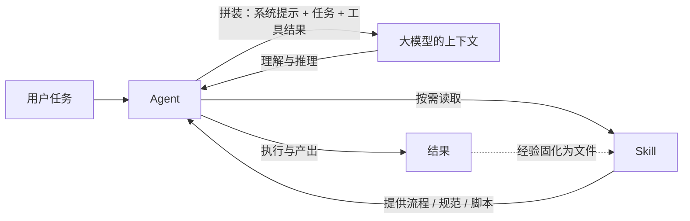

# 概念关系说明：Agent · 大模型的上下文 · Skill

## 一句话定位

| 概念 | 一句话定位 | 类比 |
|------|-----------|------|
| 大模型的上下文 | 模型在一次任务中能"看到"的全部信息：系统提示、对话历史、检索内容、工具返回结果等 | 工作台——桌面有多大、摆了什么，决定能同时处理什么 |
| Agent | 以大模型为"大脑"，能自主规划步骤、调用工具、根据反馈迭代的任务执行者 | 会自己安排工作顺序的员工 |
| Skill | 把某类任务的流程、规范、脚本和参考资料整理成的可复用知识包 | 员工的岗位手册 / 标准作业流程（SOP） |

## 上下文如何影响 Agent 的工作

Agent 的每一步推理都发生在大模型的上下文窗口里，所以上下文直接决定 Agent 能做什么、做得多好：

1. **上下文是 Agent 的全部"当下视野"。** Agent 并不会真正"记住"之前的步骤——它每一步都是把系统提示、任务目标、已有进展和工具返回结果重新拼进上下文，再让模型推理下一步。上下文里没有的信息，对 Agent 来说等于不存在。
2. **窗口有限，逼迫 Agent 学会管理记忆。** 上下文装不下时，Agent 必须做摘要、丢弃旧细节，或把中间结果写进外部文件。上下文管理的好坏，直接决定长任务会不会"忘事""跑偏"。
3. **上下文质量决定行动质量。** 同一个 Agent，给它模糊描述还是精确规范，产出差距巨大。把清晰的角色设定、任务规范、参考资料注入上下文，就是在抬高 Agent 输出的上限。

## Skill 如何沉淀可复用的任务知识

1. **Skill 把"会做"变成"写下来"。** 一次成功的经验（怎么调研、按什么结构输出、怎么自检）如果只留在一次对话里，下次就丢了；写成 SKILL.md 之后，它变成任何新任务都能加载的稳定流程。
2. **Skill 缓解了上下文有限的问题。** 流程写在文件里，Agent 不必把所有步骤都占着上下文，按需读取即可——这是对上下文限制的工程化解法。
3. **Skill 可复用、可迭代。** 本仓库的 concept-learning-generator 不只为 Agent、上下文、Skill 三个概念服务：给它任何新概念都能按同一结构产出资料，并在使用中不断修改完善。

## 三者关系图

## 我的个人理解

- "大脑—工作记忆—操作手册"的角度谈三者关系：上下文是 Agent 的工作记忆，Skill 是外置的操作手册，Agent 是调度两者完成任务的大脑。
- 本仓库当例子：AI 助手（Agent）在上下文里读到我的要求，读取 Skill 文件获得生成流程，按流程产出学习资料——没有上下文，它不知道要做什么；没有 Skill，每换个概念都要从零交代一遍流程。

## 参考来源

- [Lilian Weng: LLM Powered Autonomous Agents](https://lilianweng.github.io/posts/2023-06-23-agent/) — Agent = 规划 + 记忆 + 工具使用的经典框架
- [OpenAI: Text generation and context guides](https://platform.openai.com/docs/guides/text-generation) — 上下文窗口与对话管理的官方说明
- [Anthropic Docs: Agent Skills](https://docs.claude.com/en/docs/agents/skills) — Skill 的结构与加载机制的官方文档
